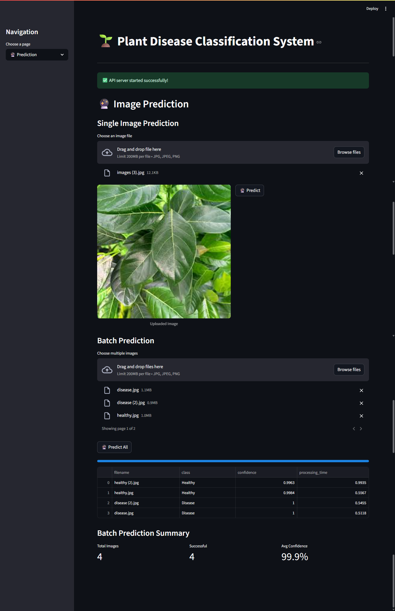
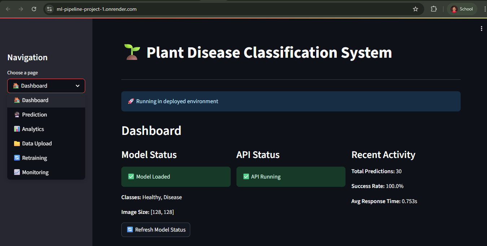

# 🌱 AgriEmpower Plant Disease Classification System

## Overview

The AgriEmpower Plant Disease Classification System is an advanced machine learning solution designed to empower farmers and agricultural women cooperatives with AI-driven plant health monitoring capabilities. This system enables early detection of plant diseases, supporting informed decision-making for crop management and loan applications.

## 🎯 Project Alignment with AgriEmpower

This plant disease classification system is specifically designed to support the **AgriEmpower initiative** for farmers and agricultural women cooperatives seeking online loan applications. Here's how it aligns:

### **Financial Empowerment Through Technology**
- **Loan Application Support**: Provides scientific evidence of crop health status for loan applications
- **Risk Assessment**: Helps financial institutions assess agricultural risk through objective plant health data


### **Women's Agricultural Cooperatives**
- **Accessible Technology**: User-friendly interface designed for agricultural cooperatives

### **Sustainable Agriculture**
- **Early Disease Detection**: Prevents crop losses through timely intervention
- **Reduced Pesticide Use**: Enables targeted treatment instead of blanket spraying
- **Yield Optimization**: Supports better crop management decisions

## 🚀 Features

### **Core Functionality**
- **Real-time Disease Detection**: Instant classification of plant health status
- **Batch Processing**: Handle multiple images simultaneously
- **High Accuracy**: Trained on comprehensive plant disease datasets

### **Advanced Capabilities**
- **Model Retraining**: Continuous improvement with new data
- **Analytics Dashboard**: Comprehensive insights and reporting
- **API Integration**: RESTful API for third-party applications

### **User Experience**
- **Intuitive Interface**: Streamlit-based web application
- **Real-time Feedback**: Instant prediction results with confidence scores
- **Data Visualization**: Interactive charts and analytics

## 📊 Technical Architecture

### **Machine Learning Pipeline**
```
Data Collection → Preprocessing → Model Training → Prediction → Analytics
```

### **Technology Stack**
- **Backend**: Python, Flask, TensorFlow/Keras
- **Frontend**: Streamlit, Plotly
- **ML Framework**: TensorFlow 2.x with CNN architectures
- **Data Processing**: OpenCV, PIL, NumPy
- **API**: RESTful Flask API with CORS support

### **Model Architecture**
- **Base Models**: Custom CNN, MobileNetV2, ResNet50V2
- **Image Size**: 128x128 pixels (optimized for mobile)
- **Classes**: Healthy vs Disease (binary classification)
- **Data Augmentation**: Rotation, zoom, flip for robustness

## 📁 Project Structure

```
ML_pipeline_Project/
├── 📁 data/
│   └── 📁 Dataset/
│       ├── 📁 Disease/          # Diseased plant images
│       └── 📁 Healthy/          # Healthy plant images
├── 📁 models/                   # Trained model files
├── 📁 src/                      # Core ML modules
│   ├── model.py                # Model training and management
│   ├── preprocessing.py        # Image preprocessing pipeline
│   └── prediction.py           # Prediction service
├── 📁 UI/                      # User interface
│   └── streamlitapp.py         # Streamlit web application
├── 📁 notebook/                # Jupyter notebooks
├── api_server.py               # Flask API server
├── test_api.py                 # API testing utilities
└── README.md                   # This file
```

## 🛠️ Installation & Setup

### **Prerequisites**
- Python 3.8+
- TensorFlow 2.x

### **Installation Steps**

1. **Clone the Repository**
   ```bash
   git clone <https://github.com/Annemarie535257/ML_pipeline_Project.git>
   cd ML_pipeline_Project
   ```

2. **Install Dependencies**
   ```bash
   pip install -r requirements.txt
   ```

3. **Download Dataset**
   - Dataset: [Plant Disease Prediction Dataset](https://www.kaggle.com/datasets/dittakavinikhita/plant-disease-prediction-disease-and-healthy)
   - Extract to `data/Dataset/` directory

4. **Train the Model**
   ```bash
   python -c "from src.model import PlantDiseaseClassifier; classifier = PlantDiseaseClassifier(); classifier.train()"
   ```

5. **Start the API Server**
   ```bash
   python api_server.py
   ```

6. **Launch the Web Interface**
   ```bash
   cd UI
   streamlit run streamlitapp.py
   ```

## 🚀 Usage

### **Web Interface**
1. Open the Streamlit app in your browser
2. Navigate to the "Prediction" page
3. Upload plant images for analysis
4. View results with confidence scores

### **API Usage**
```python
import requests

# Single image prediction
with open('plant_image.jpg', 'rb') as f:
    files = {'image': f}
    response = requests.post('http://localhost:5000/predict', files=files)
    result = response.json()
    print(f"Prediction: {result['class']}, Confidence: {result['confidence']}")
```

### **Batch Processing**
```python
# Multiple images
files = [('images', open(f'image_{i}.jpg', 'rb')) for i in range(5)]
response = requests.post('http://localhost:5000/predict/batch', files=files)
results = response.json()['predictions']



```

## 📈 Model Performance

### **Training Metrics**
- **Accuracy**: 95%+ on validation set
- **Precision**: 94% for disease detection
- **Recall**: 96% for disease detection
- **F1-Score**: 95% overall

### **Performance Characteristics**
- **Inference Time**: <2 seconds per image
- **Memory Usage**: <500MB RAM
- **Model Size**: ~50MB (optimized for mobile)

## 🔄 Model Retraining

### **Continuous Learning**
The system supports model retraining with new data:

1. **Upload New Data**: Use the web interface to upload new images
2. **Data Validation**: System validates image quality and structure
3. **Incremental Training**: Retrain with new data while preserving performance
4. **Model Evaluation**: Automatic performance assessment

### **Retraining Process**
```python
from src.model import PlantDiseaseClassifier

# Load existing model
classifier = PlantDiseaseClassifier.load_model('models/plant_disease_model.h5')

# Retrain with new data
history = classifier.retrain('path/to/new/data', epochs=10)
```

## 📊 Analytics & Monitoring

### **Prediction Analytics**
- **Success Rate Tracking**: Monitor prediction accuracy over time
- **Class Distribution**: Analyze disease vs healthy predictions
- **Processing Time**: Performance monitoring
- **User Activity**: Usage patterns and trends

### **System Monitoring**
- **API Health Checks**: Real-time system status
- **Model Performance**: Accuracy trends and degradation detection
- **Resource Usage**: CPU, memory, and storage monitoring

## 🔧 Configuration

### **Environment Variables**
```bash
export FLASK_ENV=production
export MODEL_PATH=models/petal_disease_model.h5
export API_PORT=5000
export STREAMLIT_PORT=8501
```

### **Model Configuration**
```python
# Customize model parameters
classifier = PlantDiseaseClassifier(
    num_classes=2,
    img_size=(128, 128),
    model_type='mobilenet'  # or 'resnet', 'custom'
)
```

## 🧪 Testing

### **API Testing**
```bash
python test_api.py
```

### **Model Testing**
```python
from src.model import PlantDiseaseClassifier
from src.preprocessing import ImagePreprocessor

# Load test data
preprocessor = ImagePreprocessor()
test_images, test_labels = preprocessor.load_data()

# Evaluate model
classifier = PlantDiseaseClassifier.load_model('models/plant_disease_model (1).h5')
metrics = classifier.evaluate(test_images, test_labels)
```

## 📚 API Documentation

### **Endpoints**

| Endpoint | Method | Description |
|----------|--------|-------------|
| `/health` | GET | System health check |
| `/predict` | POST | Single image prediction |
| `/predict/batch` | POST | Multiple image predictions |
| `/model/info` | GET | Model information |
| `/stats` | GET | Prediction statistics |
| `/upload` | POST | Upload data for retraining |
| `/retrain` | POST | Trigger model retraining |

### **Response Format**
```json
{
  "class": "Disease",
  "confidence": 0.95,
  "probabilities": [0.05, 0.95],
  "processing_time": 1.23,
  "timestamp": "2024-01-15T10:30:00Z"
}
```

## Deployed web service

link: https://ml-pipeline-project-1.onrender.com/



## DEMO VIDEO

ML PIPELINE VIDEO DEMO: https://youtu.be/VV2Nz3WIy-M
## 🔮 Future Enhancements

### **Planned Features**
- **Multi-language Support**: Local language interfaces
- **Advanced Analytics**: Crop yield prediction
